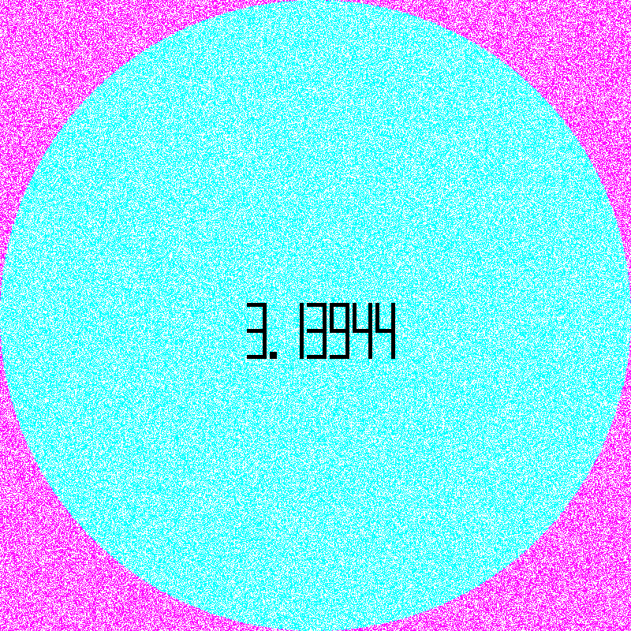

<div align="center">


A tool for creating GIF animations that visualize Monte-Carlo simulations for estimating the value of π.



</div>

## 🎓 School Project Information

|  |  |
|--|--|
| Team   | 1 |
| Course | Imperative Programming |
| School | Grenoble INP - Ensimag |

## 🛠️ How To Build

```
py ./Draw.py
```

---

<div align="center">
  Copyright &#169; 2022 PyroWilDx. All Rights Reserved.
</div>
